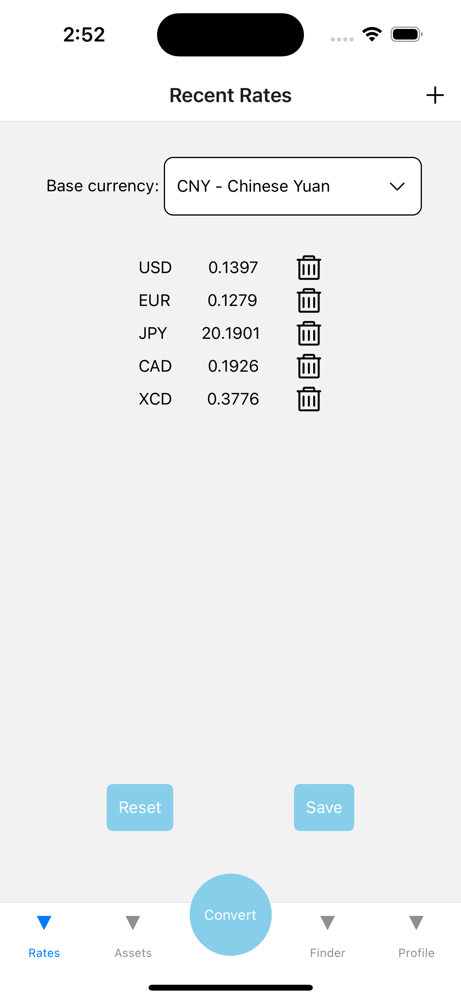
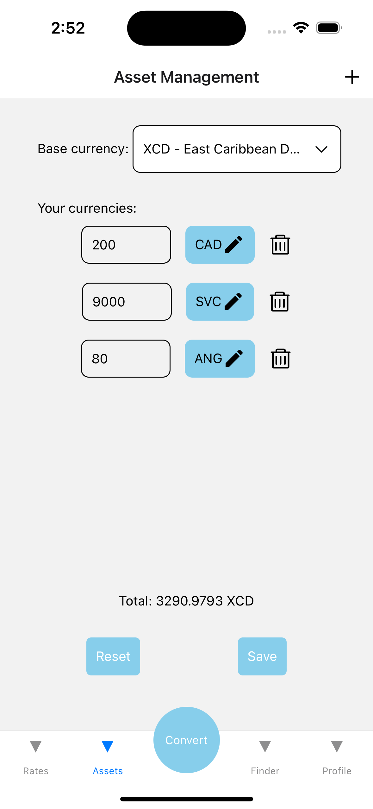
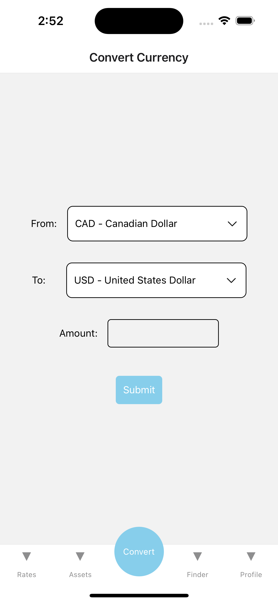
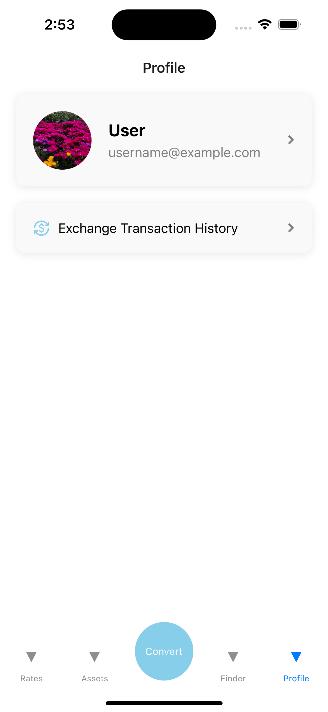
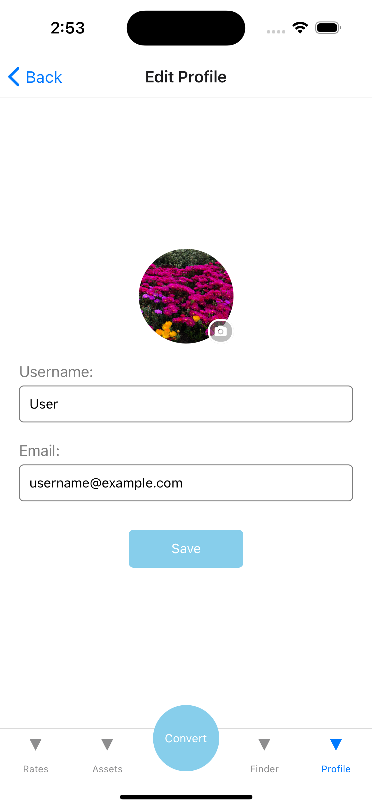
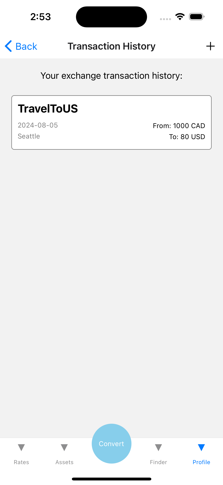
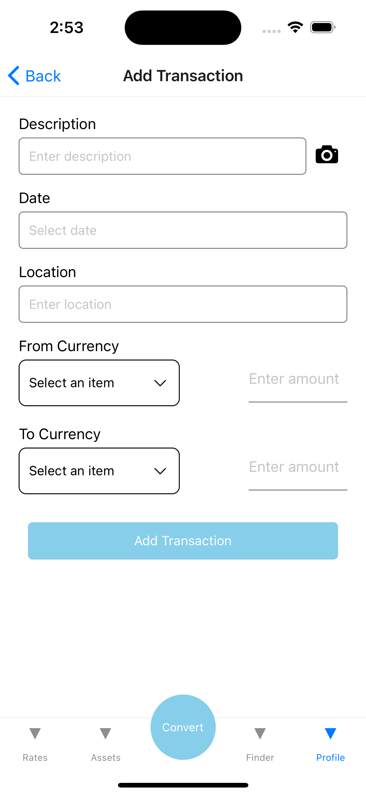
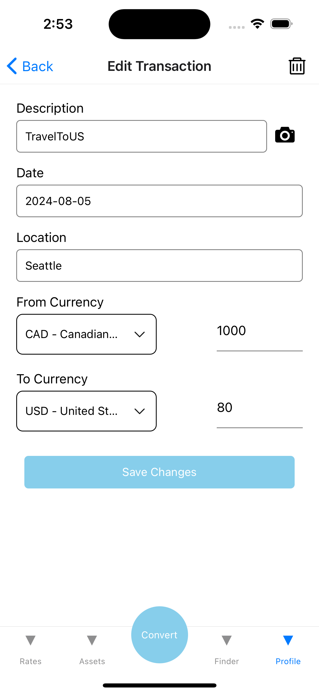

### Qianyi Fu, Liting Zhou

### <span style="color: orange;">Iteration 2</span>

### 1. Functions added in this iteration

- Authentication (added by Qianyi Fu)
- Location use (added by Liting Zhou)
- External API use (already added in Iteration 1)

### 2. Firebase rules

### 3. Current state of the application

Anonymous user can use these functions:

- customize list of interested currencies, but cannot save
- customize assets to see the total result, but cannot save
- convert currencies
- find nearby places to exchange currency

Login user can use these functions:

- customize list of interested currencies and save
- customize assets to see the total result, and save
- retrieve the saved data from DB
- convert currencies
- find nearby places to exchange currency
- edit profile
- add/edit transaction history

Currency exchange rates are called from 3rd party API (keys already sent to TAs by email):  
https://rapidapi.com/principalapis/api/currency-conversion-and-exchange-rates

Functions to be implemented:

- Camera use
- Notification
- Final styling and coloring

### 4. Screenshots

### <span style="color: orange;">Iteration 1</span>

### 1. Data model (at least 3 collections)

Collections: users  
Subcollections: transactions, notifications  
Example:

```
users:
    user1:
        name: "user1"
        email: "email1"
        password: "password1"
        image: "image1"
        currenciesBase: "CAD"
        myCurrencies:
            ["USD", "CNY"]
        assetsBase: "USD"
        myAssets:
            [{currency: "GBP", amount: "100"}, {currency: "EUR", amount: "200"}]
        transactions:
            transaction1:
                id: "transaction1"
                date: "2024-08-06"
                description: "Travel"
                location:"Vancouver"
                fromCurrency: "CAD"
                toCurrency: "USD"
                fromAmount: "100"
                toAmount: "90"
        notifications:
            notification1:
                fromCurrency: "CAD"
                toCurrency: "USD"
                thresholdRate: "0.8"
    user2:
```

### 2. Which of the CRUD operations are implemented on which collections

Users Collection:

- Write Profile to DB
- Read Profile from DB
- Update Profile in DB
- Update customized list of currencies to DB
- Read customized list of currencies from DB
- Update assets detail and base currency to DB
- Read assets detail and base currency from DB

Transactions Subcollection:

- Write Transactions to DB
- Read Transactions from DB
- Update Transactions in DB
- Delete Transaction from DB

Notifications Subcollection:

- Write Notifications to DB
- Read Notifications from DB
- Update Notifications in DB
- Delete Notifications from DB

### 3. Current state of the application

Anonymous user can use these functions:

- customize list of interested currencies, but cannot save
- customize assets to see the total result, but cannot save
- convert currencies

Fake user "User1" can use these functions (authentication not yet implemented):

- customize list of interested currencies and save
- customize assets to see the total result, and save
- retrieve the saved data from DB
- convert currencies
- edit profile
- add/edit transaction history

Currency exchange rates are called from 3rd party API:  
https://rapidapi.com/principalapis/api/currency-conversion-and-exchange-rates

Functions to be implemented:

- Authentication
- Camera use
- Location use
- Notification
- Styling and coloring

### 4. Screenshots

- Recent Rates Screen
- Asset Management Screen
- Convert Currency Screen

<div style="display: flex; justify-content: space-between;">
  
  
  
</div>
<br />

- Profile Screen

<div style="display: flex;">
  
  
</div>
<br />

- Transaction Screen
<div style="display: flex; justify-content: space-between;">
  
  
  
</div>

### 5. Contributions

#### Qianyi Fu

- screen of profile
- screen of transaction history
- components related to profile/transaction history

#### Liting Zhou

- screen of list of currencies
- screen of asset management
- screen of conversion
- components and helpers related
