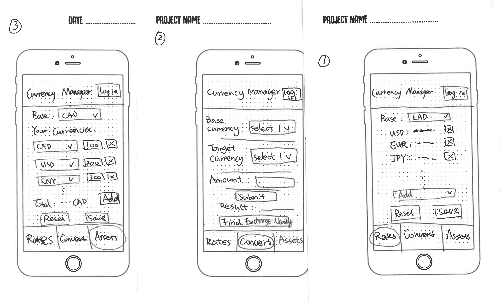
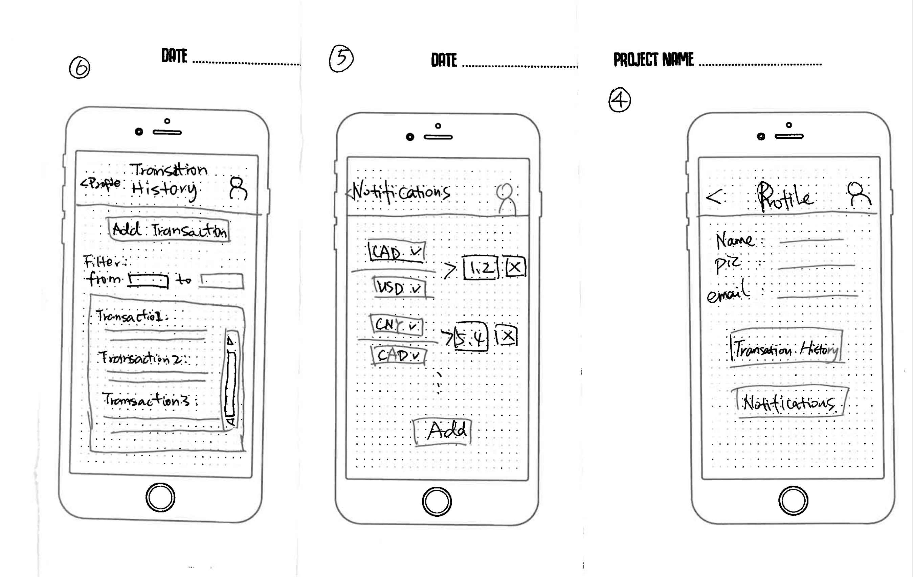
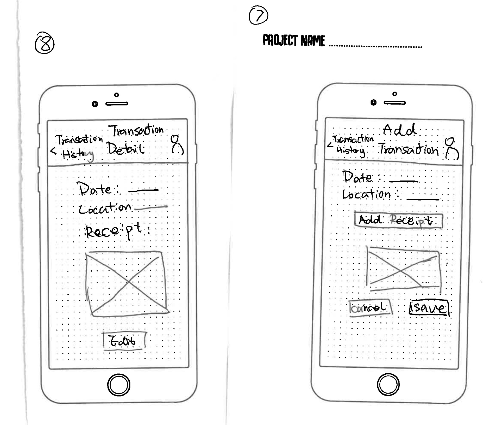
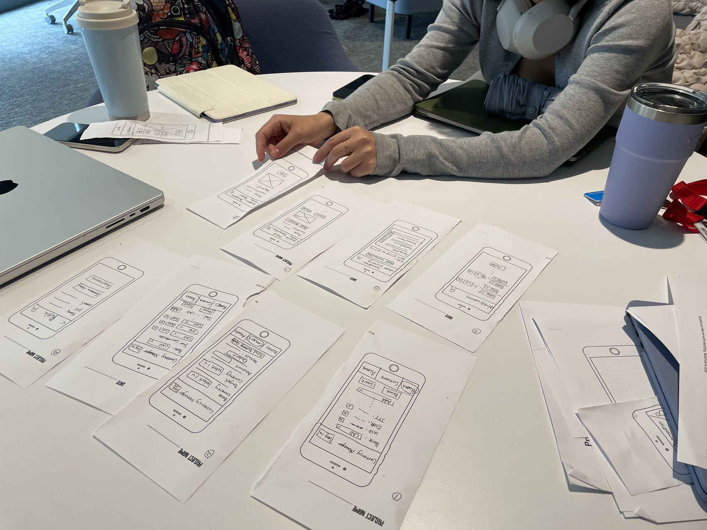

# Project Design

### Qianyi Fu, Liting Zhou

#### App introduction:

The name of our application is **Currency Manager**, which is designed to do effortless currency conversion, stay updated with the latest currency exchange rates, keep track of your currencies, find the nearby currency exchange organizations, save currency exchange history and set notifications on exchange rate changes.

#### Target users:

Currency Manager is designed for all adults who need to convert currencies and find nearby exchange organizations. It's especially ideal for those interested in forex trading and those who regularly engage in currency management.

#### Test scenarios:

- **Using Live Exchange Rates and Currency Conversion:** In this scenario, the user will explore the features live exchange rates and currency conversions. The user will set up a list of preferred currencies, changing the base currency, and adding or removing currencies from the list. Also, the user will use the currency converter to switch between different currencies.
- **Managing Financial Assets and Finding Nearby Exchange Services:** In this scenario, the user will dive into the app's asset management and location services. The user will enter details about their assets, such as investments in various currencies, and then calculates the total value of their assets in a specific currency. Also, the user will use the app's nearby exchange finder to locate currency exchange organizations in their area.

#### Questions to ask after the testing:

1. Were the list of exchange rates easy to customize, e.g., change base currency, search the currency, add, and delete?
2. Was it easy to find and use the currency conversion feature?
3. Was the _Nearby Exchange Finder_ easy to locate and activate?
4. Was it easy to perform the calculation of your total assets in different currencies?
5. Did you find the integrated camera services for capturing receipts of transactions useful?
6. Were the notification settings easy to customize to your preferences?
7. Upon logging in, was it easy to save and manage your customized data?
8. How does Currency Manager compare to other currency conversion apps you have used?
9. Were there any features you found particularly useful?
10. Are there any features you feel are missing or unnecessary for your needs?
11. What could be added or improved to keep you engaged with the app over time?

#### The sketches used for testing:

#### User 1:

- Comments and Feedbakcs from the user:
1. Were the list of exchange rates easy to customize, e.g., change base currency, search the currency, add, and delete?
It was very convenient; I could quickly find the features I needed.
2. Was it easy to find and use the currency conversion feature?
It was relatively easy to find; the convert section is right in the middle at the bottom of the interface.
3. Was the _Nearby Exchange Finder_ easy to locate and activate?
It was relatively easy to find, on the convert section's page.
4. Was it easy to perform the calculation of your total assets in different currencies?
Very convenient, it can be found in the asset section.
5. Did you find the integrated camera services for capturing receipts of transactions useful?
Quite useful, it can be used to add notes to each transaction.
6. Were the notification settings easy to customize to your preferences?
It was relatively simple to modify, and I could set the alert values.
7. Upon logging in, was it easy to save and manage your customized data?
Very convenient, after logging in I can check the data I saved at any time.
8. How does Currency Manager compare to other currency conversion apps you have used?
The main functions are very simple and convenient, and the feature to find nearby exchanges is very useful.
9. Were there any features you found particularly useful?
The features are quite practical, used frequently in everyday life scenarios.
10. Are there any features you feel are missing or unnecessary for your needs?
The current features are all quite practical.
11. What could be added or improved to keep you engaged with the app over time?
I hope to be able to name each transaction when recording it, which would make it easier to remember. The notification interface is a bit unclear; the current layout and display mode make the usage of this feature somewhat unclear. The Nearby Exchange Finder feature could not only be placed in the convert section but could also be made into a floating button style, allowing users to use this feature in various scenarios.

- Photos of of paper prototyping:

#### User 2:

- Comments and Feedbakcs from the user:

1. Were the list of exchange rates easy to customize, e.g., change base currency, search the currency, add, and delete?
Yes
2. Was it easy to find and use the currency conversion feature?
Yes, very easy
3. Was the _Nearby Exchange Finder_ easy to locate and activate?
Not very fast to find. Maybe add it to a fourth screen.
4. Was it easy to perform the calculation of your total assets in different currencies?
Yes. Easy and intuitive
5. Did you find the integrated camera services for capturing receipts of transactions useful?
Yes. 
6. Were the notification settings easy to customize to your preferences?
Not very intuitive. But I can figure it out quickly.
7. Upon logging in, was it easy to save and manage your customized data?
Yes, very easy
8. How does Currency Manager compare to other currency conversion apps you have used?
I've never used currency conversion apps.
9. Were there any features you found particularly useful?
Yes, the assets management page is very cool
10. Are there any features you feel are missing or unnecessary for your needs?
All the features are necessary. 
11. What could be added or improved to keep you engaged with the app over time?
On the Assets screen, it's better to place the Add button next to "Your currencies...". Better change the button title to "Exchange Transaction History" in Profile page to make it clearer. The Notification page could be clearer by adding a title "Notify me when..." to the page.

- Photos of of paper prototyping:

#### User 3:

- Comments and Feedbakcs from the user:

- Photos of of paper prototyping:

#### The updated sketches on the feedbacks:

#### Lessons learned and key takeaways:

