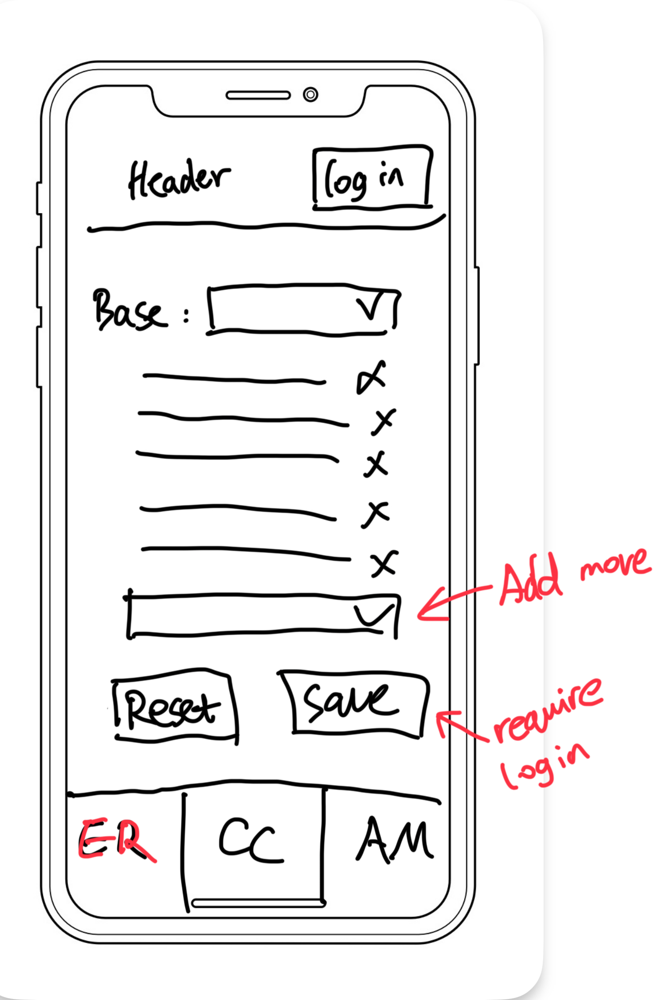
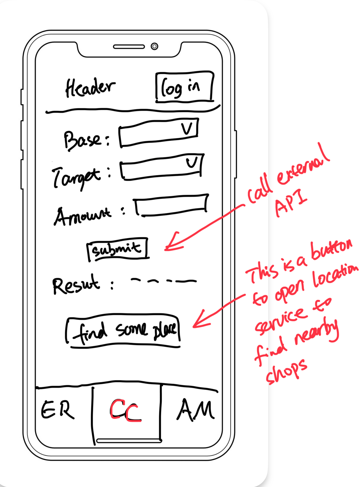
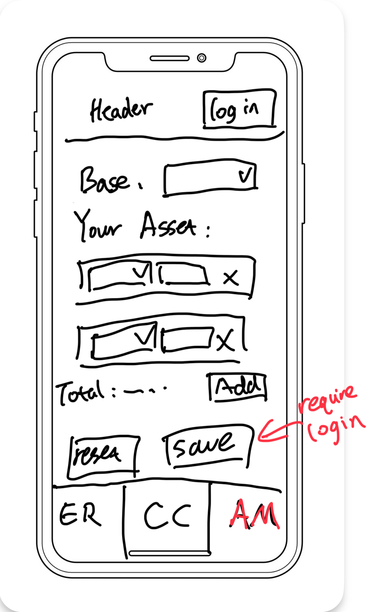
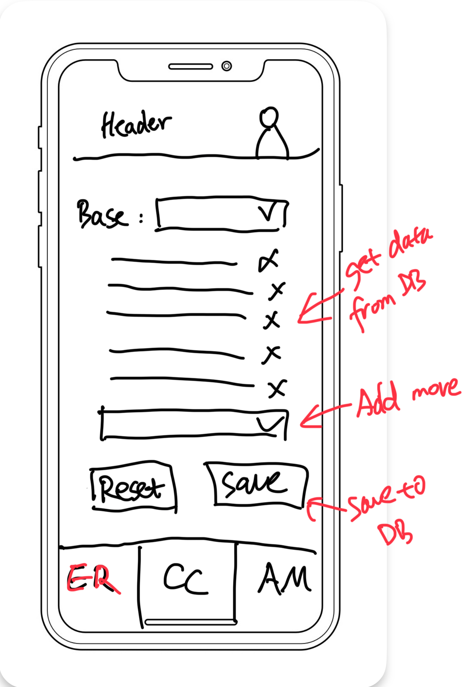
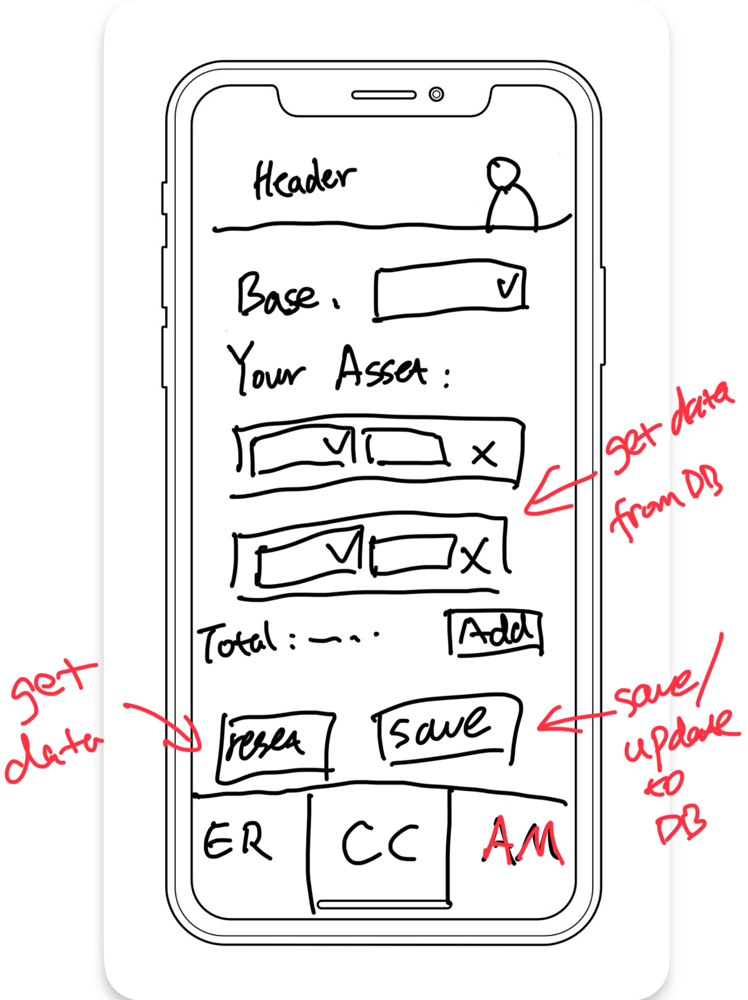
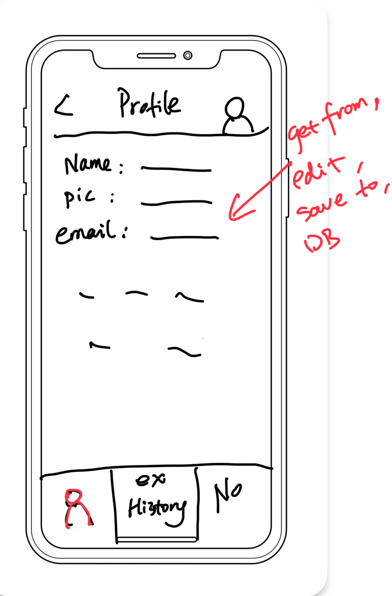
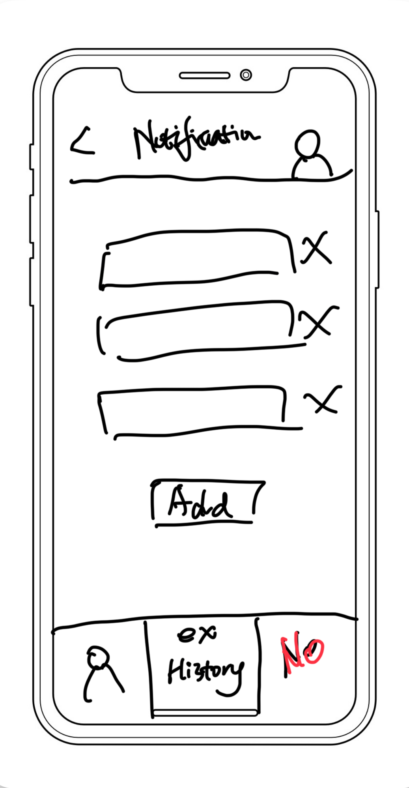
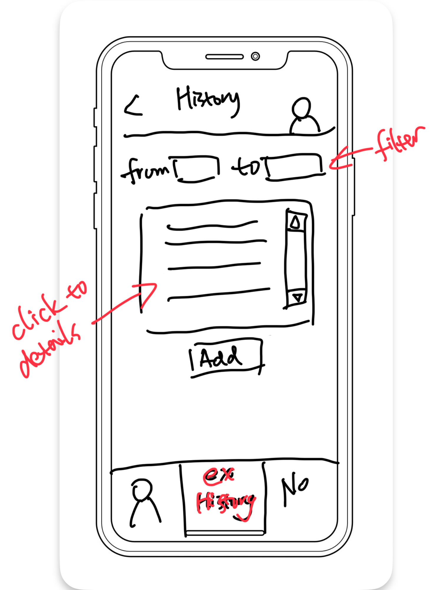
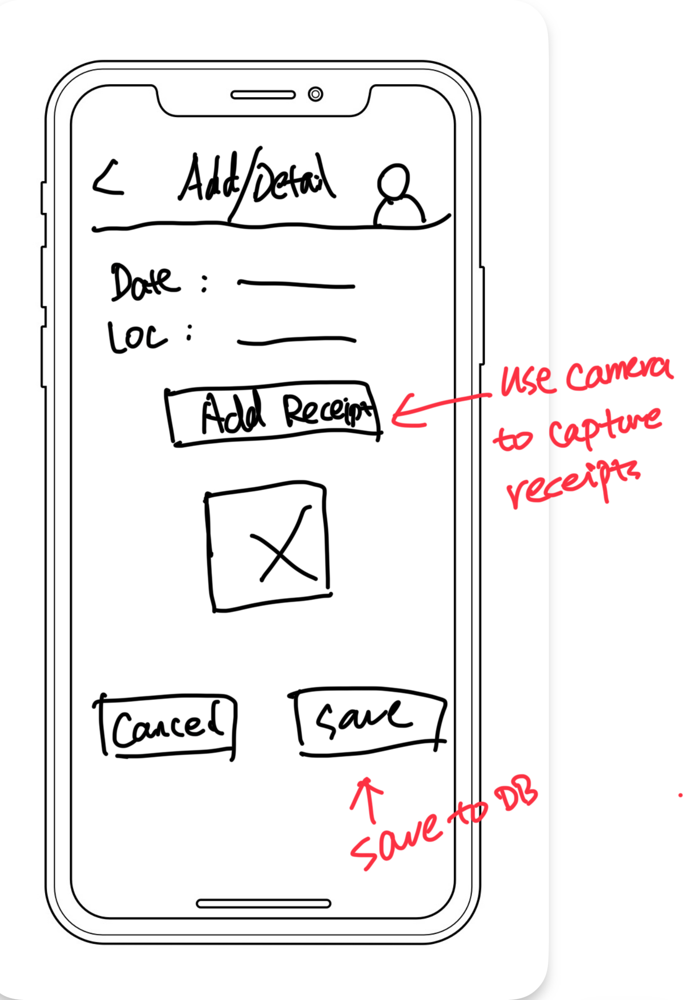

# Project Proposal

### Qianyi Fu, Liting Zhou

#### App Name:

Currency Companion

#### App Description:

**Currency Companion: Your Ultimate Currency Conversion and Asset Management Tool**

Discover the power of seamless currency conversion and efficient asset management with Currency Companion, the ultimate app designed to cater to both casual users and financial enthusiasts. Whether you're a frequent traveler, a savvy investor, or just curious about global exchange rates, Currency Companion has everything you need in one sleek and user-friendly package.

FEATURES

Effortless Currency Conversion:  
Instantly convert between multiple currencies with real-time exchange rates. Simply input your amount and let Currency Companion do the rest.

Live Exchange Rates:  
Stay updated with the latest currency exchange rates. View a comprehensive list of current rates to make informed decisions on the go.

Asset Management:  
Keep track of your financial assets with ease. Monitor your investments, and get an overview of your financial asset.

Nearby Exchange Finder:  
Find the nearest currency exchange organizations with our integrated location services. Get directions and contact information for your convenience.

Anonymous and Secure:  
Use the app anonymously or create an account for personalized features.

Integrated Camera Services: Capture receipts, documents, or any important information using the camera.

Currency Companion is your reliable partner for all things currency-related. Download now and take control of your financial world, whether at home or abroad!

**Experience the future of currency management with Currency Companion. Download today and make every conversion count!**

#### App Slogan:

Currency Companion: Your Reliable Financial Ally!

#### Target Users:

Currency Companion is designed for all adults who need to convert currencies and find nearby exchange organizations. It's especially ideal for those interested in forex trading and those who regularly engage in personal asset management.

#### UI sketches:

Anonymous users can use the app to browse real-time exchange rates, perform currencies conversions, find nearby currency exchange locations and calculate assets. Users need to login if they want to save any customized contents.

There will be a tab navigator at the bottom to navigate these functions.

  
  
  

In login mode, customized data would be retrieved from, updated to or saved to database.

  
  

Click the upper right button to go to the profile. There is also a tab navigator at the bottom, where users can update profile information, keep record of currency exchange (where you can use camera to capture receipts etc.), and set notification list. Users may want to know if some exchange rates exceed a threshold.

  
  

Click an item or press "Add" button to navigate to "Detail/Add" screen.

  
  

